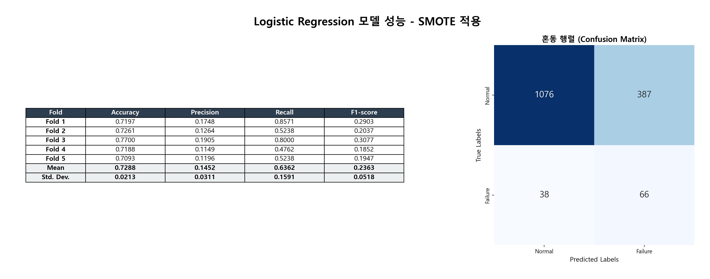
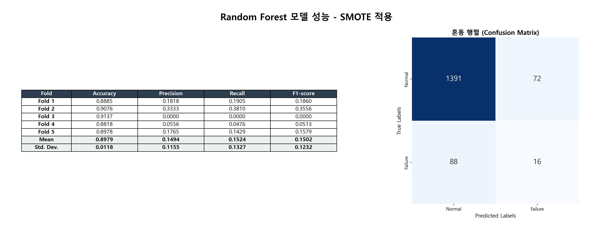
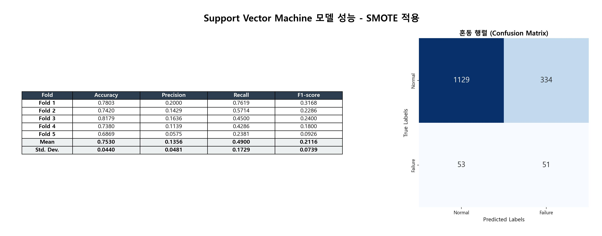

# Semiconductor Wafer Fault Diagnosis: Optimizing Recall for Industrial Quality Assurance

## 📌 Project Overview
In semiconductor manufacturing, detecting wafer defects accurately is critical for quality control. This project aims to classify wafers as either faulty or normal based on sensor data, addressing the challenge of highly imbalanced datasets.

Specifically, in a production environment, the cost of a **False Negative (missing a defect)** is significantly higher than a False Positive. Therefore, this project prioritizes **Recall (Sensitivity)** to ensure maximum reliability in fault detection.

## 📊 Dataset Specification
- **Source:** UCI SECOM Dataset
- **Scale:** ~15,670 samples with 591 sensor features.
- **Class Distribution:** Highly imbalanced (Normal: ~93%, Faulty: ~7%).
- **Target:** Binary classification (Normal vs. Faulty).

## 🛠 Methodology

### 1. Data Preprocessing & Feature Engineering
- **Handling Missing Values:** Implemented robust imputation techniques to manage incomplete sensor readings.
- **Feature Selection:** Reduced dimensionality from 591 to the **top 20 most predictive features** using statistical correlation analysis, minimizing noise and preventing overfitting.
- **Addressing Imbalance:** Applied **SMOTE (Synthetic Minority Over-sampling Technique)** on the training set to synthetically balance the minority (Faulty) class.

### 2. Model Development & Comparison
We evaluated multiple classifiers using **5-Fold Stratified Cross-Validation** to ensure robust performance estimation:
- **Linear Models:** Logistic Regression
- **Tree-based Models:** Decision Tree, Random Forest, Gradient Boosting
- **Kernel-based Models:** Support Vector Machine (SVM)
- **Probabilistic Models:** Naive Bayes
- **Neural Networks:** Multilayer Perceptron (MLP)

## 📈 Experimental Results

| Model | Accuracy | Precision | **Recall (Sensitivity)** | F1-Score |
| :--- | :---: | :---: | :---: | :---: |
| **Logistic Regression** | 0.7288 | 0.1452 | **0.6362** $\uparrow$ | 0.2363 |
| Support Vector Machine | 0.7530 | 0.1356 | 0.4900 | 0.2116 |
| Gradient Boosting | 0.8251 | 0.1429 | 0.3371 | 0.2002 |
| Decision Tree | 0.8194 | 0.1195 | 0.2605 | 0.1636 |
| Random Forest | **0.8979** $\uparrow$ | 0.1494 | 0.1524 | 0.1502 |
| MLP | 0.8915 | 0.1765 | 0.1914 | 0.1798 |

### 💡 Engineering Insight: Why Logistic Regression?
While **Random Forest** achieved the highest accuracy (89.79%), its **Recall was only 15.24%**, meaning it would fail to detect ~85% of actual defects. 

In contrast, **Logistic Regression** achieved a **Recall of 63.62%**. In an industrial manufacturing context, the ability to catch more defects (High Recall) is more critical than overall accuracy, making Logistic Regression the most viable model for early warning systems.

## 🖼 Visual Analysis

### Confusion Matrix (Top Models)
Below are the confusion matrices for our most significant models, illustrating the trade-off between precision and recall.

| Logistic Regression (Best Recall) | Random Forest (Best Accuracy) | SVM (Balanced) |
| :---: | :---: | :---: |
|  |  |  |

## 🎯 Key Outcomes
- **Optimized Detection:** Successfully improved fault detection Recall to **63.6%** using SMOTE and Logistic Regression.
- **Dimensionality Reduction:** Identified **20 critical sensors** out of 591, streamlining the monitoring process.
- **Decision Support:** Provided a data-driven rationale for prioritizing **Recall-centric models** in high-stakes manufacturing environments.

## 💻 Tech Stack
- **Language:** Python
- **Libraries:** scikit-learn, pandas, numpy, imbalanced-learn, matplotlib, seaborn
